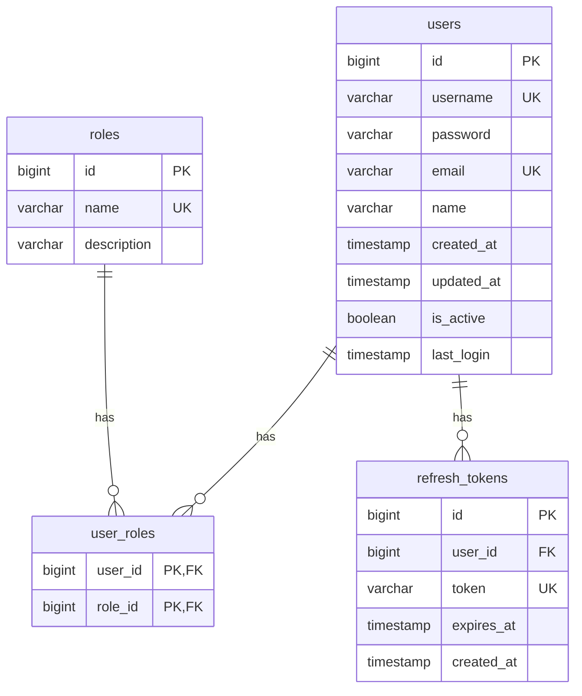

# 데이터 베이스 디자인

## ERD


## Table Details

### users
| Column     | Type         | Constraints      | Description |
|------------|--------------|------------------|-------------|
| id         | BIGINT       | PK, AUTO_INCREMENT | 사용자 식별자 |
| username   | VARCHAR(50)  | UNIQUE, NOT NULL | 로그인 ID |
| password   | VARCHAR(100) | NOT NULL         | 암호화된 비밀번호 |
| email      | VARCHAR(100) | UNIQUE, NOT NULL | 이메일 주소 |
| name       | VARCHAR(100) | NOT NULL         | 사용자 이름 |
| created_at | TIMESTAMP    | DEFAULT NOW()    | 계정 생성일시 |
| updated_at | TIMESTAMP    | DEFAULT NOW()    | 정보 수정일시 |
| is_active  | BOOLEAN      | DEFAULT TRUE     | 계정 활성화 상태 |
| last_login | TIMESTAMP    | NULL            | 마지막 로그인 시간 |

### roles
| Column      | Type        | Constraints      | Description |
|-------------|-------------|------------------|-------------|
| id          | BIGINT      | PK, AUTO_INCREMENT | 역할 식별자 |
| name        | VARCHAR(20) | UNIQUE, NOT NULL | 역할 이름 |
| description | VARCHAR(100)| NULL            | 역할 설명 |

## Table Roles and Relationships

### Core Tables

#### users (사용자 테이블)
- 시스템의 모든 사용자 정보를 저장
- 로그인 및 인증에 필요한 기본 정보 관리
- 사용자 상태 및 활동 이력 추적
- 주요 용도:
    - 로그인 인증
    - 사용자 프로필 관리
    - 계정 상태 관리
    - 활동 이력 추적

#### roles (역할 테이블)
- 시스템에서 사용되는 모든 권한 역할 정의
- 기본 제공 역할:
    - ROLE_ADMIN: 시스템 전체 관리 권한
    - ROLE_MANAGER: 보험 청구 관리 권한
    - ROLE_USER: 일반 사용자 권한
- 역할별 상세 권한:
    - ROLE_ADMIN
        - 사용자 관리
        - 역할 관리
        - 시스템 설정 관리
    - ROLE_MANAGER
        - 보험 청구 승인/거절
        - 보험금 산정
        - 청구 이력 관리
    - ROLE_USER
        - 개인 정보 조회/수정
        - 보험금 청구
        - 청구 상태 조회

### Relationship Tables

#### user_roles (사용자-역할 매핑 테이블)
- users와 roles 테이블의 다대다(N:M) 관계 구현
- 한 사용자가 여러 역할을 가질 수 있음
- 한 역할은 여러 사용자에게 할당될 수 있음
- 사용 예시:
    - 보험 관리자가 일반 사용자 권한도 함께 가질 수 있음
    - 시스템 관리자가 모든 권한을 가질 수 있음

#### refresh_tokens (리프레시 토큰 테이블)
- JWT 토큰 갱신을 위한 정보 저장
- 사용자별 리프레시 토큰 관리
- 주요 기능:
    - 자동 로그인 지원
    - 액세스 토큰 만료시 재발급
    - 토큰 유효성 검증
- 보안 관련:
    - 토큰 만료 시간 설정
    - 사용자별 토큰 제한
    - 토큰 재사용 방지

## Table Relationships
1. users ⟷ user_roles
    - 한 사용자는 여러 역할을 가질 수 있음
    - 사용자 삭제시 연관된 user_roles 데이터도 삭제

2. roles ⟷ user_roles
    - 한 역할은 여러 사용자에게 할당 가능
    - 역할 삭제시 연관된 user_roles 데이터 삭제 전 검증 필요

3. users ⟷ refresh_tokens
    - 한 사용자는 여러 리프레시 토큰을 가질 수 있음
    - 사용자 삭제시 연관된 모든 토큰 삭제

## Data Integrity Rules
1. 사용자 생성시 최소 1개의 역할 필수 할당
2. 리프레시 토큰은 사용자당 최대 5개까지만 유지
3. 기본 역할(ROLE_USER)은 삭제 불가
4. 마지막 관리자 역할은 삭제 불가

## 인덱스 전략
1. users 테이블
    - PK: id (클러스터 인덱스)
    - UK1: username
    - UK2: email

2. roles 테이블
    - PK: id
    - UK1: name

## 데이터 마이그레이션
초기 데이터 설정은 `src/main/resources/db/migration/` 경로의 Flyway 스크립트로 관리
```
V1__Create_Tables.sql
V2__Insert_Default_Roles.sql
```